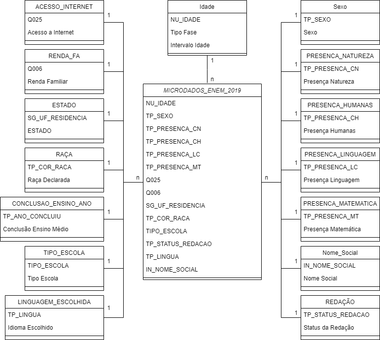

    
# Enem 2019 - DashBoard

Aqui desenvolvir um Dashboard com os dados do Enem de 2019 com objetivo de visualizar alguns dados socieconomicos e educacionais.
 
 

## Origem dos dados

Os dados foram obtidos através do [Instituto Nacional de Estudos e Pesquisas Educacionais Anísio Teixeira | Inep](https://www.gov.br/inep/pt-br/acesso-a-informacao/dados-abertos/microdados/enem)
 
 
  
## Ferramentas e tecnologias utilizadas

Por se tratar de um volume grande de dados optei por fazer uma analise exploratorio carregando a base no Jupyter-Notebook.
Depois de entender o que tinha na base e de fazer as trativas iniciais partir para carregar-la no PorwerBI e por fim iniciar a modelagem dos dados e contrução do DashBoard.

 

 
    
    
    
    

 
 

## Tratamento e Modelagem dos Dados

Analisando o dicionário de dados da base, selecionei as seguintes colunas para o projeto:

| Coluna     | Descrição                |
| :------- | :------------------------- |
| SG_UF_RESIDENCIA | Sigla da Unidade da Federação de residência |
| NU_IDADE | Idade |
| TP_SEXO | Sexo |
| TP_COR_RACA | Cor/raça |
| TP_ANO_CONCLUIU | Ano de Conclusão do Ensino Médio |
| TP_ESCOLA | Tipo de escola do Ensino Médio |
| IN_NOME_SOCIAL | Indicador de inscrito que se declarou travesti, transexual ou transgênero e solicitou atendimento pelo Nome Social |
| NU_NOTA_CN | Nota da prova de Ciências da Natureza |
| NU_NOTA_CH | Nota da prova de Ciências Humanas |
| NU_NOTA_LC | Nota da prova de Linguagens e Códigos |
| NU_NOTA_MT | Nota da prova de Matemática |
| TP_STATUS_REDACAO | Situação da redação do participante |
| NU_NOTA_REDACAO | Nota da prova de redação |
| TP_LINGUA | Língua Estrangeira  |
| Q006 | Qual é a renda mensal de sua família? (Some a sua renda com a dos seus familiares.) |
| Q025 | Na sua residência tem acesso à Internet? |
| TP_PRESENCA_CN | Presença na prova objetiva de Ciências da Natureza |
| TP_PRESENCA_CH | Presença na prova objetiva de Ciências Humanas |
| TP_PRESENCA_LC | Presença na prova objetiva de Linguagens e Códigos |
| TP_PRESENCA_MT | Presença na prova objetiva de Matemática |

### Criei algumas tabelas auxiliares para relacionar com as colunas que possuem codigos e IDs para a informação, melhorando a compreensão das informações.

* Idade
* Sexo
* PRESENCA_NATUREZA
* PRESENCA_HUMANAS
* PRESENCA_LINGUAGEM
* PRESENCA_MATEMATICA
* ACESSO_INTERNET
* RENDA_FA
* ESTADO
* RAÇA
* CONCLUSAO_ENSINO_ANO
* TIPO_ESCOLA
* REDAÇÃO
* LINGUAGEM_ESCOLHIDA

Exemplo de tabela auxiliar:

| TP_STATUS_REDACAO | Status da Redação |
| :------- | :------------------------- |
| 1 |Sem problemas |
| 2 |Anulada |
| 3 |Cópia Texto Motivador |
| 4 |Em Branco |
| 6 |Fuga ao tema |
| 7 |Não atendimento ao tipo textual |
| 8 |Texto insuficiente |
| 9 |Parte desconectada |
| 0 |Não Presente |

O Relacionamento das tabelas auxiliares ficou assim:

  
## Authors

- [@leandric](https://www.github.com/octokatherine)

